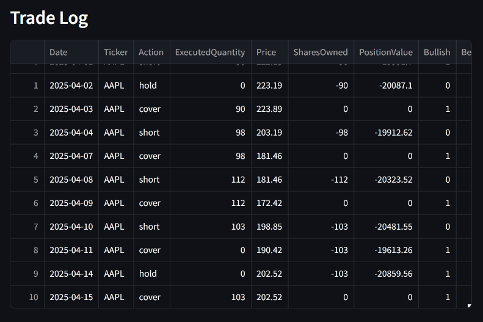

# AI Hedge Fund Simulator & Backtester (Enhanced)

## Overview

This project provides an enhanced AI-powered platform for stock analysis, trading simulation, and backtesting. It combines functionalities and insights from the original [virattt/ai-hedge-fund](https://github.com/virattt/ai-hedge-fund) project with features inspired by [jayash1973/INVESTO-Stock-Predictor](https://github.com/jayash1973/INVESTO-Stock-Predictor).

The system utilizes a team of AI agents, including simulations of famous investors and specialized analysts, to analyze stocks from multiple perspectives and generate trading signals. It features a Streamlit web interface for easy interaction and visualization.

**Note:** This project is for educational and research purposes only and is not intended for real trading or investment advice.

## Key Features

*   **Multi-Agent Stock Analysis:** Leverages diverse AI agents:
    *   **Investor Personas:** (Warren Buffett, Cathie Wood, Michael Burry, etc.) Simulate famous investment strategies.
    *   **Analytical Specialists:** Technical, Fundamentals, Sentiment, Valuation, and Quantitative analysis.
*   **Flexible LLM Support:** Configurable to use different Large Language Models, currently allowing selection between DeepSeek V3 and OpenAI GPT-4o via the UI, using the OpenAI-compatible API approach for DeepSeek.
*   **Trading Simulation:** Simulates buy/sell/short/cover decisions based on aggregated agent signals and portfolio management logic.
*   **Historical Backtesting:** Tests trading strategies against historical market data.
*   **Interactive Web UI:** Built with Streamlit, featuring:
    *   Multi-language support (English, Simplified Chinese, Traditional Chinese).
    *   Configuration options for tickers, dates, and model selection.
    *   Visualization of quantitative indicators using Plotly charts.
    *   Detailed signal display with reasoning (when available).
*   **Enhanced Technical Analysis:** Incorporates a wider range of technical indicators inspired by INVESTO-Stock-Predictor (visible in the Quantitative Analyst chart).

## Recent Updates (Collaboration Summary)

This version includes significant enhancements developed collaboratively:

*   **Localization:** Added Simplified and Traditional Chinese language support to the Streamlit UI.
*   **Model Integration:** Integrated DeepSeek models (selectable via UI) alongside OpenAI GPT-4o, using the OpenAI-compatible API approach for DeepSeek based on official documentation. Configured model selection in the UI, limiting options to tested models.
*   **Backtester Fixes:**
    *   Resolved `KeyError: 'decisions'` by safely accessing potentially missing keys.
    *   Fixed `AttributeError: 'list' object has no attribute 'get'` by correcting list processing for the trade log.
    *   Corrected backtest results display logic to properly separate summary `performance_metrics` (dictionary) from the detailed `trade_log` (DataFrame).
    *   Addressed various `IndentationError` and `SyntaxError` issues.
*   **UI/UX Improvements:**
    *   Fixed Streamlit sidebar visibility issues (`st.set_page_config`).
    *   Implemented color-coding for trading signals (Buy/Hold/Sell).
    *   Adjusted font sizes and styles for better readability.
    *   Refactored signal display layout from horizontal columns to a clearer vertical, per-ticker format.
    *   Addressed the `DeprecationWarning` related to DeepL API usage checks.
*   **Core Logic:**
    *   Configured core analytical agents (Technical, Fundamentals, etc.) to run mandatorily in simulations, removing them from user selection.
    *   Added timing logs (`[TIME LOG]`) around the core AI agent workflow (`app.invoke`) for performance monitoring.
*   **Dependency Management:** Transitioned dependency management approach during development (from Poetry attempts to pip/requirements.txt).

## Setup

1.  **Clone the Repository:**
    ```bash
    # Clone your repository
    git clone https://github.com/bryankuok2024/AI-Hedge-Fund-Stock-Predictor.git
    cd AI-Hedge-Fund-Stock-Predictor
    ```
2.  **Set up Python Environment:** Create and activate a virtual environment (recommended).
    ```bash
    # Example using venv
    python -m venv .venv
    # On Windows:
    .\.venv\Scripts\activate
    # On macOS/Linux:
    # source .venv/bin/activate
    ```
3.  **Install Dependencies:**
    ```bash
    pip install -r requirements.txt
    ```
    *(Ensure `requirements.txt` includes all necessary packages like `streamlit`, `pandas`, `plotly`, `langchain`, `langchain-openai`, `python-dotenv`, `deepl`, `requests`, `matplotlib`, `colorama`, `questionary`, `numpy`, `python-dateutil` etc. Add any missing ones.)*
4.  **Configure API Keys:**
    *   Copy the example environment file:
        ```bash
        # On Windows:
        copy .env.example .env
        # On macOS/Linux:
        # cp .env.example .env
        ```
    *   Edit the `.env` file and add your API keys:
        *   `DEEPSEEK_API_KEY`: Required if using DeepSeek models.
        *   `OPENAI_API_KEY`: Required if using OpenAI models (like GPT-4o).
        *   `DEEPL_API_KEY`: Required for UI translation features. Get from [DeepL](https://www.deepl.com/).
        *   `FINANCIAL_DATASETS_API_KEY`: Required for fetching financial data for most tickers. Get from [Financial Datasets](https://financialdatasets.ai/).
        *   *(Add keys for Anthropic, Groq, Gemini if you plan to use those models and re-enable them)*

## Usage

Run the Streamlit web application:

```bash
streamlit run src/webapp.py
```

Navigate to the displayed local URL (usually `http://localhost:8501`) in your web browser. Use the interface to configure tickers, dates, select investor persona agents, choose the AI model (DeepSeek V3 or GPT-4o), and run simulations or backtests.

## Simulation Example

Simulation mode runs the AI agents once for the entire selected date range, using data available at the end date to make a single trading decision. This is useful for getting a quick analysis based on the latest available information.

**1. Configuration:**
Select "Simulation" mode, enter tickers, dates, and choose optional advanced settings (like specific agents or AI model).


**2. Running Simulation:**
Click the "Run" button. The application will process the data and run the selected AI agents.


**3. Final Decisions:**
The primary output is the "Final Decisions" table, showing the suggested action (Buy, Sell, Hold, etc.), quantity, confidence, and the reasoning behind the decision for each ticker.


**4. Individual Agent Signals:**
This section breaks down the signals and reasoning generated by each individual agent (Investor Personas and Analytical Specialists) that contributed to the final decision.


## Backtest Example

Backtest mode simulates trading day-by-day through the selected date range (starting with $100,000 initial capital by default), using only historical data available up to each specific day to make decisions. It calculates performance metrics based on these simulated trades.

**1. Configuration:**
Select "Backtest" mode, enter tickers, and the desired date range. Advanced options for agent selection and reasoning display are disabled for backtesting.


**2. Performance Metrics:**
After running, the backtest displays key performance indicators, such as Total Return %, Sharpe Ratio, Maximum Drawdown, Win Rate, etc., summarizing the strategy's historical performance.


**3. Trade Log:**
A detailed Trade Log shows the actions taken on each day for each ticker, along with portfolio state (shares owned, position value, cash).


**4. Portfolio Value Chart:**
A Portfolio Value Chart visually represents the growth (or decline) of the simulated portfolio over the backtest period.


## Running with Docker (Recommended for Consistent Environment)

This project includes a `Dockerfile` to run the application in a containerized environment.

1.  **Build the Docker Image:**
    *   Make sure you have Docker installed and running.
    *   Navigate to the project's root directory in your terminal.
    *   Run the build command:
        ```bash
        docker build -t ai-hedge-fund-app .
        ```
        *(This will build an image named `ai-hedge-fund-app` using the `Dockerfile` in the current directory.)*

2.  **Run the Docker Container:**
    *   Ensure your `.env` file in the project root directory contains the necessary API keys.
    *   Run the container using the following command:
        ```bash
        docker run --rm -p 8501:8501 --env-file .env ai-hedge-fund-app
        ```
        *   `--rm`: Automatically removes the container when it exits.
        *   `-p 8501:8501`: Maps port 8501 from your host machine to port 8501 inside the container.
        *   `--env-file .env`: Loads environment variables (like your API keys) from the `.env` file into the container.
        *   `ai-hedge-fund-app`: The name of the image you built.

3.  **Access the Application:**
    *   Open your web browser and navigate to `http://localhost:8501`.

## Project Origin & Inspiration

This project builds upon the foundations laid by two open-source projects:

*   **[virattt/ai-hedge-fund](https://github.com/virattt/ai-hedge-fund):** Provided the initial multi-agent framework, backtesting structure, and core simulation logic.
*   **[jayash1973/INVESTO-Stock-Predictor](https://github.com/jayash1973/INVESTO-Stock-Predictor):** Inspired the integration of more detailed technical analysis and visualization features.

This enhanced version aims to combine the strengths of both approaches.

## Contributors

*   **Bryan Kuok** ([bryankuok2024](https://github.com/bryankuok2024)) - Lead Developer
*   **Gemini (AI Assistant)** - Pair Programming, Code Generation, Debugging, Refactoring

## Disclaimer

This project is for **educational and research purposes only**.

*   Not intended for real trading or investment advice.
*   No warranties or guarantees are provided regarding accuracy or performance.
*   Past performance does not indicate future results.
*   The creators assume no liability for any financial losses incurred based on the use of this software.
*   Always consult with a qualified financial advisor before making investment decisions.

By using this software, you agree to accept all risks associated with its use and acknowledge its educational nature.
